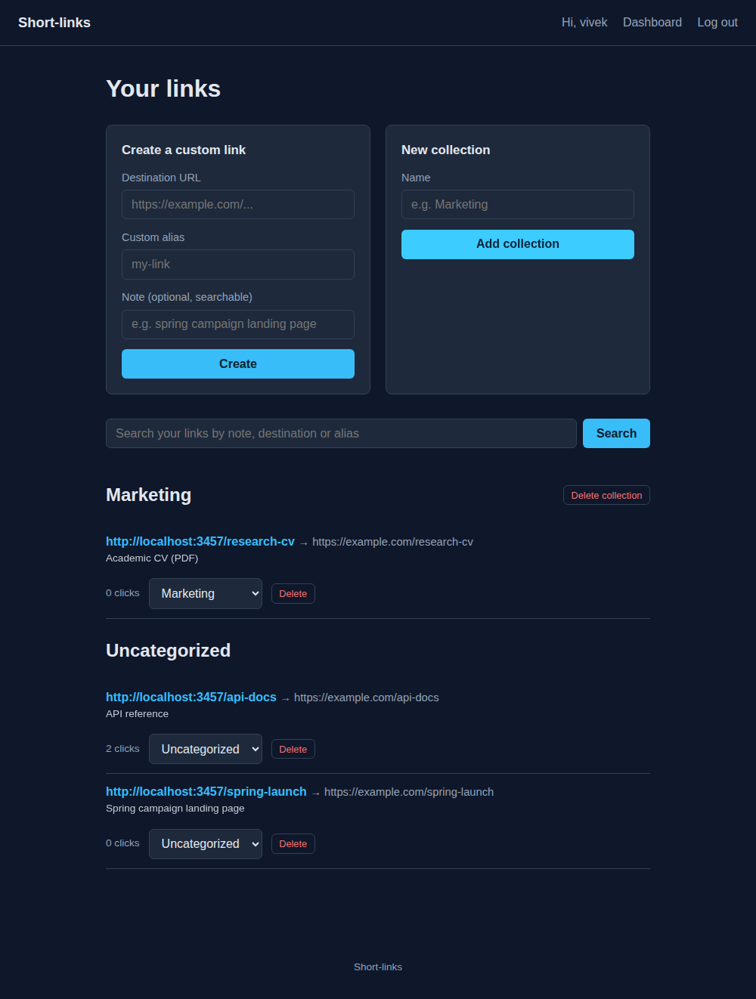

# Short-links

[](https://github.com/VivekReddy2001/Short-links/actions/workflows/ci.yml)


A small self-hosted URL shortener. Paste a long URL, get a short one back, no account needed. Sign in and you also get custom aliases, notes you can search, a dashboard with live click counts, and collections to file your links into.



## Features

- **Anyone** can shorten a URL from the home page. Codes are 6 random characters from `crypto.randomInt`, checked for collisions.
- **Signed-in users** additionally get:
  - **custom aliases** (`/my-link`, 3-32 letters, digits, `-` and `_`),
  - an optional **note** on every link, and **search** across notes, destinations and aliases,
  - a **dashboard** listing every link with its click count,
  - **collections** to group links, with links movable between them,
  - **deletion** of links (freeing the alias) and of collections (their links move back to Uncategorized).
- **Shorten now, sign in to save:** try to create a custom link while logged out, and you're sent to sign in or register; the link is created automatically once you're in. See `docs/ARCHITECTURE.md` for the sequence diagram.

## Getting started

You'll need Node 22.13+ and either a local MongoDB or a free [Atlas](https://www.mongodb.com/atlas) cluster.

```bash
git clone https://github.com/VivekReddy2001/Short-links.git
cd Short-links
npm ci
cp .env.example .env
# edit .env: set MONGODB_URI to your database, and SESSION_SECRET to a random string
npm start
```

Then open `http://localhost:3000`. `npm run dev` restarts the server on file changes (`node --watch`).

## Security

The app has had a proper hardening pass; [`SECURITY.md`](SECURITY.md) has the details and the remaining known gaps.

| Protection | How |
|---|---|
| CSRF | Per-session synchronizer token in every form, checked on every POST; logout is a POST too |
| Brute force and spam | 20 sign-in/registration and 60 link-creation POSTs per 15 minutes per IP |
| Session fixation | Session id regenerated on every sign-in |
| Sessions | Stored in MongoDB (connect-mongo); cookie `httpOnly`, `SameSite=Lax`, `Secure` in production |
| Injection | Forms parsed as flat strings only (`extended: false`); ids validated before queries; search terms regex-escaped |
| Passwords | bcrypt; 8-72 bytes; failed logins for unknown users take as long as wrong passwords |
| Link targets | Only `http://` and `https://` URLs can be shortened |

**If you are the original account holder:** the MongoDB credentials that used to be hardcoded in `database.js` were public on GitHub. If that Atlas account is still in use, rotate its password and check the cluster's access logs. See [`SECURITY.md`](SECURITY.md).

## Tests

```bash
npm test      # Jest + Supertest against a real in-memory MongoDB
npm run lint  # ESLint
```

38 tests drive the actual app over HTTP, with no mocked database:

| Suite | What it proves |
|---|---|
| `shortening.test.js` | Shortening, redirects and click counting; `javascript:`/`data:`/non-URL rejection; 404s; CSRF enforcement, including tokens from another session; link-creation rate limiting; following a short link creates no session |
| `accounts.test.js` | Registration rules, bcrypt hashing, duplicate usernames, identical errors for wrong password and unknown user, `username[$ne]` injection, session-id rotation on login, POST-only logout, auth rate limiting, sign-in-to-save handshake |
| `dashboard.test.js` | Custom aliases and their validation, collections, filing links, deleting links and collections, cross-user isolation, malformed ids, search by note/destination/alias, literal (non-regex) search |
| `session-store.test.js` | Sessions persisted to MongoDB through connect-mongo, as in production |

CI runs lint and tests on Node 22 and 24, then boots the app against a real MongoDB service container.

## Project structure

```
app.js                       # createApp(): sessions, CSRF, rate limits, routers; start() when run directly
database.js                  # Mongo connection (reads MONGODB_URI)
lib/
  csrf.js                    # synchronizer-token CSRF protection
  rateLimit.js               # express-rate-limit policies
  session.js                 # signIn(): regenerate the session, keep any pending action
  input.js                   # form-field and id helpers, alias pattern, regex escaping
  validate.js                # http(s)-only URL validation
  generateHash.js            # random 6-char code generator, checks for collisions
  requireAuthOrQuickShorten.js  # "signed in, or this is the anonymous quick-shorten button"
  requireLogin.js            # plain "must be signed in" gate
  resumePendingAction.js     # finishes a queued shorten-while-logged-out request after login
Routes/
  homeRouter.js              # GET /, POST /, GET /:code (resolve + redirect)
  loginRouter.js, registerRouter.js, logoutRouter.js
  dashboardRouter.js         # GET /dashboard, with ?q= search
  CustumUrlRouteres.js       # POST /app/ — custom-alias links
  addCollections.js          # POST /addcollections
  collectionsRouter.js       # POST /collections/:id/delete
  linksRouter.js             # POST /links/:id/delete
  ChangeCollectionRoutner.js # POST /change_collection — file a link into a collection
Schemas/
  User.js, Collection.js, UrlMaps.js
views/                       # EJS templates (partials/csrf.ejs goes in every form)
public/css/style.css
tests/                       # Jest + Supertest suites
docs/ARCHITECTURE.md
SECURITY.md
```

## Tech stack

| Layer | Choice |
|---|---|
| Server | Express 5 |
| Views | EJS 6 (server-rendered, no client-side framework) |
| Database | MongoDB via Mongoose 9 |
| Auth | `express-session` with sessions in MongoDB (`connect-mongo`), `bcrypt` password hashing |
| Abuse controls | `express-rate-limit`, built-in CSRF tokens |
| Tests | Jest, Supertest, mongodb-memory-server |
| Config | `dotenv`, see `.env.example` |

## Project history: the 2026 rebuild

This repo, as originally uploaded, had `app.js` requiring a `Routes/` and `Schemas/` directory that didn't exist anywhere in its git history — the routing layer and data models were never committed, so the app couldn't start. It also had a live MongoDB Atlas password committed in plaintext.

Rebuilding this was a bigger job than a typical cleanup, so here's exactly what was done, grouped by how invasive it was:

| Change | Why |
|---|---|
| **Wrote `Routes/*.js` and `Schemas/*.js` from scratch** | These were referenced by `app.js` and `generateHash.js` but never existed in the repo. The route names, the middleware's redirect-then-resume dance, and the collections feature implied by `addCollections`/`ChangeCollectionRoutner` were all inferred from the files that *did* exist and built out to match. |
| **Moved the database credentials out of source** | `database.js` had a real Atlas username and password hardcoded and committed. See **Security** below — this one's urgent. |
| **Fixed a route-mounting order bug** | The short-link resolver (`GET /:code`) would have shadowed `/dashboard`, `/addcollections`, etc. if mounted before them; fixed the order in `app.js`. |
| **Fixed a Mongoose field-name collision** | A schema field named `collection` collides with a reserved property every Mongoose document has; renamed to `collectionId`. Found this by actually running the app against a real database, not by inspection. |
| **Removed unused/duplicate/deprecated dependencies** | `package.json` listed `curl`, `url-exist`, `url-exists`, `url-validation`, `valid-url`, and `shortid` — none of them used anywhere in the code, several overlapping, `shortid` deprecated. Also added `dotenv` and `express-async-errors`, both of which the rebuilt app needed (the latter has since been dropped: Express 5 forwards async errors natively). |
| **Restricted shortenable URLs to http/https** | `validate.js` accepted any scheme `new URL()` could parse, including `javascript:`. Narrowed it to `http:`/`https:`. |
| **Wrote the views, CSS, and the rest of the plumbing (sessions, error handling, 404/500 pages) needed to actually run it** | There was no `views/` or `public/` directory either. |

Everything above is a from-scratch build against the shape the existing files implied, not a restoration of lost code — there was no original app.js/database.js worth diffing against for the missing pieces. See `docs/ARCHITECTURE.md` for how it all fits together.

## Roadmap / good first contributions

- Password reset / account recovery (needs an email field).
- Editing a link's destination or note after creation.
- Per-link analytics (clicks over time, referrers) instead of a single counter.
- Abuse controls for public deployments: a domain blocklist and a report flow.

## License

MIT, see [`LICENSE`](LICENSE).

## Author

Vivek Reddy ([@VivekReddy2001](https://github.com/VivekReddy2001))
