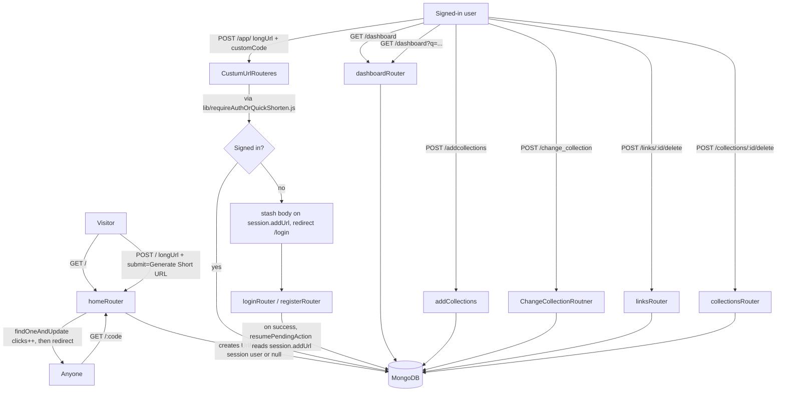
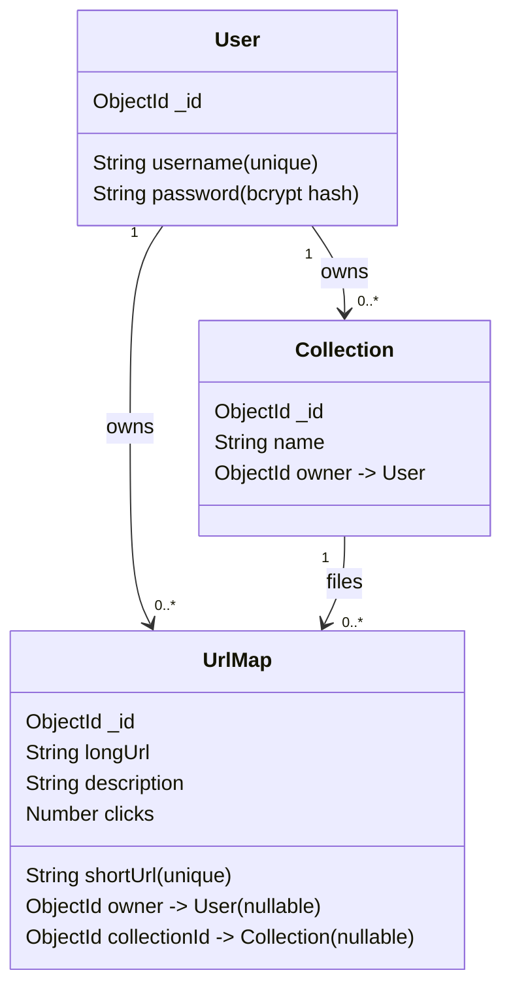
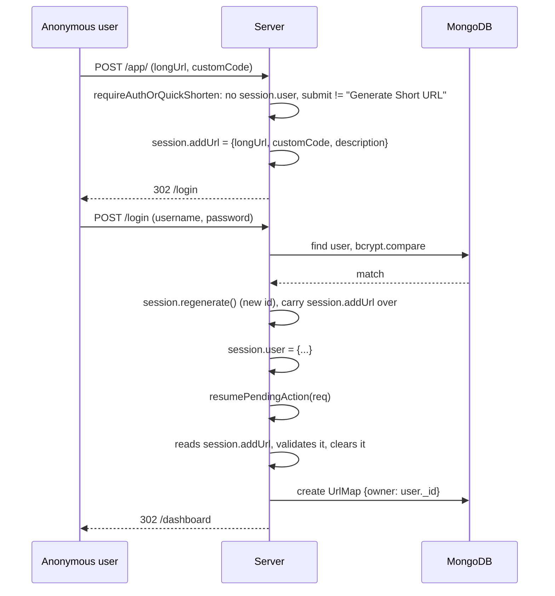
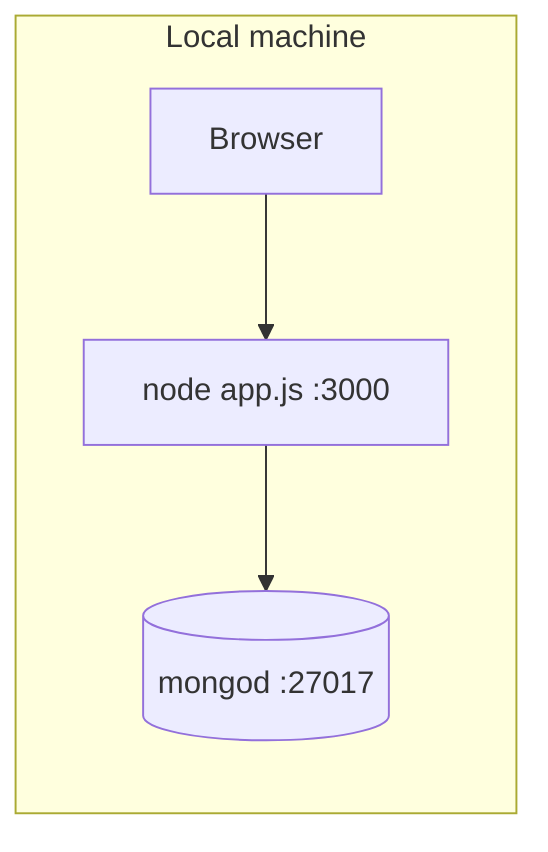

# Architecture

## What this is

A small self-hosted URL shortener built on Express 5, EJS, and MongoDB (via Mongoose 9). Anyone can shorten a link from the home page with no account. Creating an account additionally gets you:

- **Custom aliases** — pick your own short code instead of a random one.
- **A dashboard** — every link you've made, with a live click count.
- **Notes and search** — an optional note on each link; search by note, destination or alias.
- **Collections** — named folders to file your links into.
- **Deletion** — remove a link (freeing its alias) or a collection (its links move back to Uncategorized).

## Request flow

## Data model

`UrlMap.owner` and `UrlMap.collectionId` are both nullable: an anonymous shortener submission has neither; a signed-in user's plain "Generate Short URL" click has an owner but no collection until they file it with `/change_collection`.

One implementation note worth flagging for anyone extending this: Mongoose documents reserve the property name `collection` for the underlying MongoDB collection handle, so a schema field named `collection` breaks model compilation with a cryptic `Cannot read properties of undefined` error at startup. This schema uses `collectionId` instead — found the hard way, while first wiring this up.

## The "shorten now, sign in to save" handshake

This is the one piece of cross-cutting logic in the app, and it's what `lib/requireAuthOrQuickShorten.js`, `lib/resumePendingAction.js`, and `session.addUrl` exist for:

The plain "Generate Short URL" button on the home page is exempt from this — `requireAuthOrQuickShorten` checks for that exact submit value and lets it through regardless of session state, which is how anonymous shortening works at all.

## Route mounting order

`app.js` mounts `homeRouter` at `/` **last**, after every other router. `homeRouter` owns `GET /:code` (the short-link resolver), and Express matches mounted routers in registration order — if it were mounted before, say, `/dashboard`, every dashboard request would first match `/:code` with `code = "dashboard"` and 404 as an unknown short link. This exact ordering bug existed in the app as briefly reconstructed before testing caught it; the fix is just mount order, not routing logic.

## Request pipeline and security layers

Every request passes through the same middleware, in this order (`app.js`):

| Layer | What it does |
|---|---|
| `express-session` + connect-mongo | Signed `httpOnly`, `SameSite=Lax` cookie (`Secure` in production); session data in MongoDB |
| `express.urlencoded({ extended: false })` | Every form field is a plain string, so `username[$ne]=x` can never become a query operator |
| `lib/csrf.js` | Synchronizer token: one random token per session, rendered into every form as `_csrf`, checked on every POST. The token is created lazily, only when a page renders, so visitors who just follow a short link never get a session |
| `lib/rateLimit.js` | 20 sign-in/registration POSTs and 60 link-creation POSTs per 15 minutes per IP; page views are never throttled |
| Routers | Each validates its own input with the helpers in `lib/input.js` (`str`, `isObjectId`, the alias pattern) and scopes every query by `owner` |
| Error handler | CSRF failures render a 403 page; anything else is logged and renders a 500 page |

Signing in (`lib/session.js`) always regenerates the session id, so an id planted before login is worthless after it. Unknown usernames are checked against a dummy bcrypt hash, so a failed login takes the same time whether or not the username exists.

## Storage

Everything lives in one MongoDB database: `users`, `urlmaps` and `collections` (Mongoose's default pluralization), plus `sessions`, written by connect-mongo so sign-ins survive restarts and work across several app processes. No caching layer, no queue — every request that touches data does a direct Mongo round-trip, which is fine at this scale.

## Local development

See the README's **Getting started** section for the exact commands.

## Tests

`npm test` runs Jest + Supertest against a real in-memory MongoDB (mongodb-memory-server): 38 tests across shortening and redirects, CSRF, rate limiting, registration and login (including session-id rotation and operator-injection attempts), the sign-in-to-save handshake, custom aliases, collections, cross-user access, deletion, search, and the MongoDB session store.
