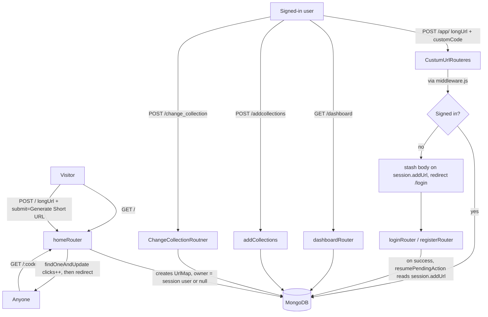
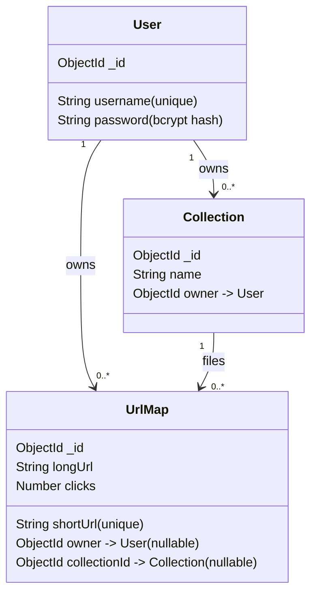
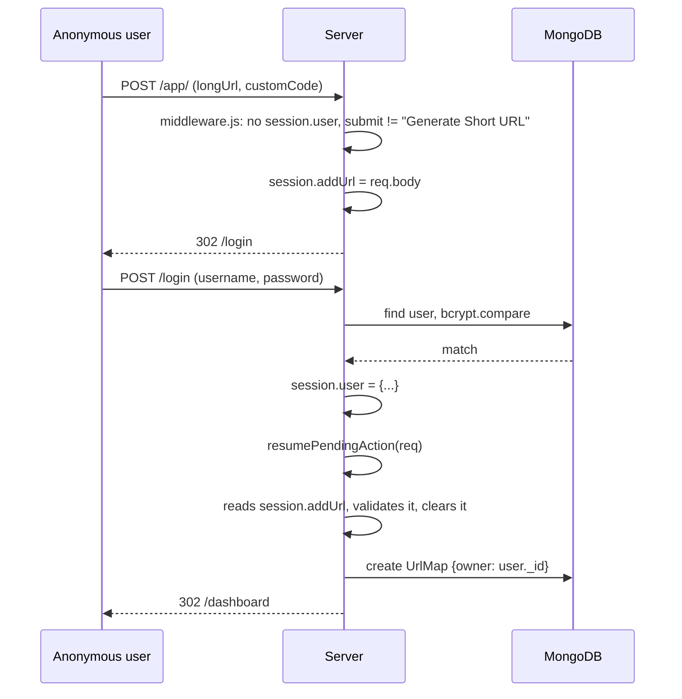
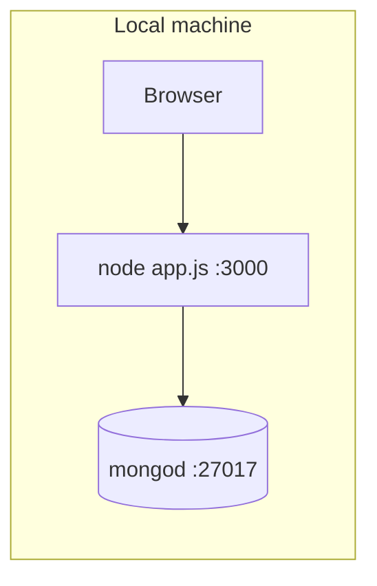

# Architecture

## What this is

A small self-hosted URL shortener built on Express, EJS, and MongoDB (via Mongoose). Anyone can shorten a link from the home page with no account. Creating an account additionally gets you:

- **Custom aliases** — pick your own short code instead of a random one.
- **A dashboard** — every link you've made, with a live click count.
- **Collections** — named folders to file your links into.

## Request flow

## Data model

`UrlMap.owner` and `UrlMap.collectionId` are both nullable: an anonymous shortener submission has neither; a signed-in user's plain "Generate Short URL" click has an owner but no collection until they file it with `/change_collection`.

One implementation note worth flagging for anyone extending this: Mongoose documents reserve the property name `collection` for the underlying MongoDB collection handle, so a schema field named `collection` breaks model compilation with a cryptic `Cannot read properties of undefined` error at startup. This schema uses `collectionId` instead — found the hard way, while first wiring this up.

## The "shorten now, sign in to save" handshake

This is the one piece of cross-cutting logic in the app, and it's what `middleware.js`, `resumePendingAction.js`, and `session.addUrl` exist for:

The plain "Generate Short URL" button on the home page is exempt from this — `middleware.js` checks for that exact submit value and lets it through regardless of session state, which is how anonymous shortening works at all.

## Route mounting order

`app.js` mounts `homeRouter` at `/` **last**, after every other router. `homeRouter` owns `GET /:code` (the short-link resolver), and Express matches mounted routers in registration order — if it were mounted before, say, `/dashboard`, every dashboard request would first match `/:code` with `code = "dashboard"` and 404 as an unknown short link. This exact ordering bug existed in the app as briefly reconstructed before testing caught it; the fix is just mount order, not routing logic.

## Storage

Everything lives in one MongoDB database, three collections (`users`, `urlmaps`, `collections`, per Mongoose's default pluralization). No caching layer, no queue — every request that touches data does a direct Mongo round-trip. Fine at this scale; see SECURITY.md #7 for the one thing (session storage) that won't survive being scaled past a single process as-is.

## Local development

See the README's **Getting started** section for the exact commands.
